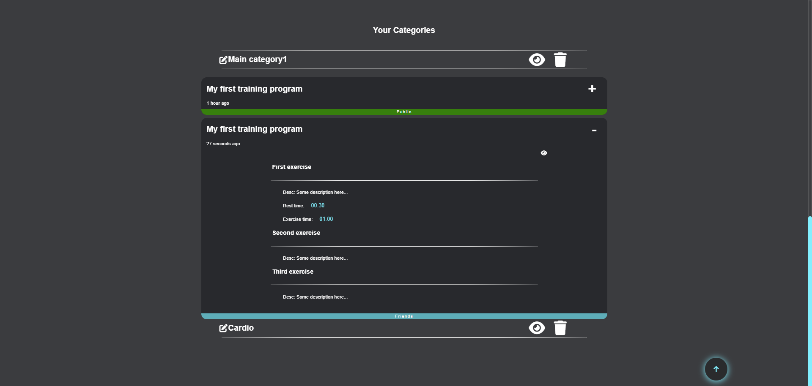

# Client API Documentation
This is the API documentation where you will be able to find information on all information about the "*Online Training Schedule*" project.

## Used dependencies:
- react
- react-dom
- react-router-dom
- react-input-emoji
- jwt-decode
- emoji-picker-react
- awesome-snackbar
- socket.io-client
- timeago.js
- uuidv4

### Instalation and start client in client folder:

### To install all dependencies
```bash
npm i
```

### To start application
```bash
npm start
```
# Introduction
The idea of the application is a Traning Schedule Online where after successful registration or login, you can see all about your friends and their personal training programs, create own training program, posts, you can share your training programs and posts for all or only for your friends, naturally we can't have an app without chat comunication, for that we have also a chat. We also have a calendar where you can set your events and to set up your schedule more easily!

### Different pages
  - Login
  - Register
  - Home
  - Training
  - Profile
  - Chat
  - Search
  
# How it works

- [x] **Home page (guest)**

Every ```guest``` can see a Home page with information about the site and some information about how to use it.


- [x] **Home page (user)**

Every ```user``` can see a Home page with all create post section and all or friends posts and comment section below.

```CREATE POST```


```All posts / Friends posts```


- [x] **Training (user)**

On this page you can see your ```Calendar Schedule```, ```Create new Training program``` and ```Your Categories```

```CALENDAR SCHEDULE``` here you can see and create your events!


```CREATE TRAINING PROGRAM``` here you can create your own training program!


```YOUR CATEGORIES``` here you can see your categories and their training inside in!



- [x] **Profile (user)**

On this page you can see your ```Profile account information```, ```Followers```, ```Following```, ```Your posts```, ```Your training programs```, ```Saved posts```, ```Saved training programs``` and also to ```Edit your profile```

```PROFILE``` here you can see your profile information!


```FOLLOWERS``` here you can see your followers!


```FOLLOWING``` here you can see your following!


```YOUR POSTS``` here you can see your posts!


```YOUR TRAINING PROGRAMS``` here you can see your training programs!


```PROFILE EDIT``` here you can edit your profile account information!


- [x] **Chat (user)**

On this page you can see your ```Chats```

```CHAT``` here you can see your chats!


```CHAT MESSAGES``` here you can see your chat messages!


- [x] **About**

On this page you can see information about creator, links for ```Github```, ```Linkedin```, ```Facebook```, ```Instagram```

```ABOUT``` here you can see about page!


- [x] **Search (user)**

On this page you can find everyone in site!

```SEARCH``` here you can see about page!


## END
